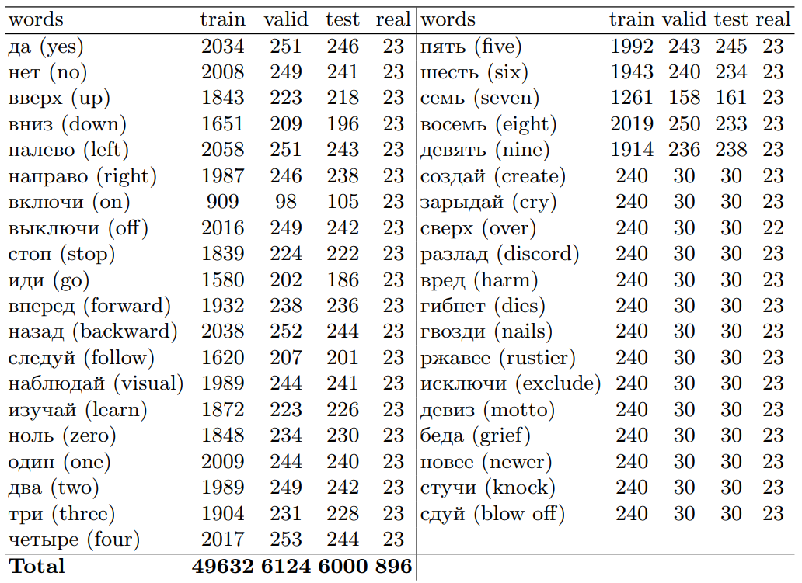

# Synth-ruSC

Synthetic dataset to solve the KWS problem in Russian.

This repository provides dataset and additional materials of the paper: "Synth-ruSC: Construction and Validation of Synthetic Dataset to Solve the Problem of Keyword Spotting in Russian" (submitted for review).

The Synth-ruSC dataset is available for download at [this link](https://cloud.mail.ru/public/eNA1/FDgVqAbJL).

Required external libs
---
Some additional materials are necessary to work with the repository:
1. The Speech Command dataset version 0.02 from Google (GSC-v2). We used scripts from NeMo to get google speech commands dataset and create manifests.
For more details see [this link](https://github.com/NVIDIA/NeMo/blob/main/scripts/dataset_processing/process_speech_commands_data.py)
2. Voice-Activity-Detection (VAD) model: [SG-VAD](https://github.com/jsvir/vad);
3. Model for generating audio: [xtts-v2](https://coqui.ai/blog/tts/open_xtts)
4. A few Speech-To-Text (STT) models:
  - [Whisper v3](https://huggingface.co/openai/whisper-large-v3)
  - [NVIDIA Conformer-CTC Large (NeMo)](https://huggingface.co/nvidia/stt_ru_conformer_ctc_large)
  - [Vosk-model-ru-0.42](https://alphacephei.com/vosk/models)

See ["Requirements"](#requirements) for the rest of the required python libs.

Pipeline
---
The process included the following main stages:
1. Generation of a synthetic audio recordings using a Text-to-Speech (TTS) model;
2. Trimming of the generated audio recordings using Voice-Activity-Detection (VAD) model;
3. Filtering of the obtained audio with faulty generation, artifacts, or low audio quality using Speech-to-Text (STT) models.

There is a python notebooks with code for each of the stages in the `./notebooks/` directory.

Dataset Statistics
---
Table 1. The statistics of the collected Synth-ruSC dataset (”good” samples group).


Additionally, 896 audio recordings (column "real") were collected from 23 people (13 men and 10 women). Each participant spoke each of the 39 words once (1 word “over” from 1 man was pronounced incorrectly, so it was removed from the test set).

Requirements
---
The main Requirements are as follows:
- Python 3.9+
- torch==2.3.0
- transformers==4.41.1
- [TTS](https://docs.coqui.ai/en/latest/installation.html)
- [sgvad](https://github.com/jsvir/vad)
- [nemo](https://github.com/NVIDIA/NeMo)
- [vosk-transcriber](https://alphacephei.com/vosk/install)

All libraries used in the project are listed in the `requirements.txt` file.

Note: You may find that STT libraries may conflict with each other, so you can create a different virtual environment for each of them.


Citing & Authors
---
If you have found our results helpful in your work, feel free to cite our publication and this repository as
```
coming soon
```

Contributions
---
Thanks to [@naumov-al](https://github.com/naumov-al) for adding the code and materials.